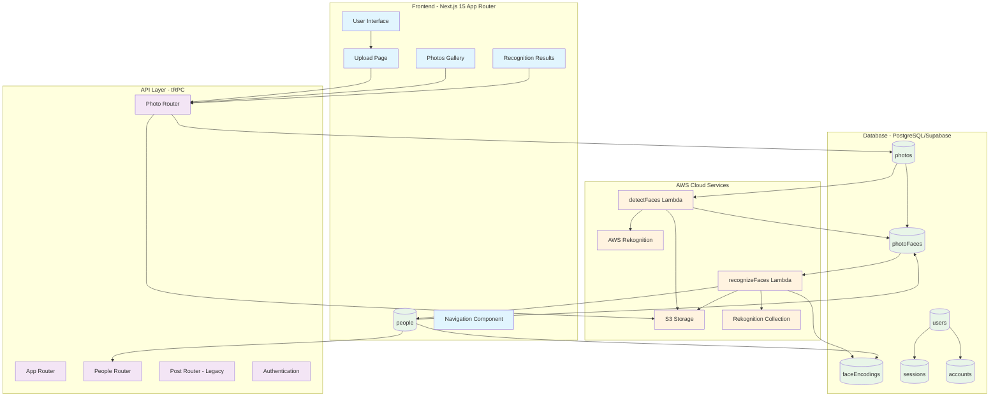

# F3 Face Recognition Service - Architecture

## System Overview

The F3 Face Recognition Service is a modern T3 Stack application designed to process group photos and identify people using AI-powered face recognition. The system is built for small organizations (~20 users) and can process 1000+ photos per month with 15-20 people per photo in under 2 minutes.

## Architecture Diagram



## System Components

### Frontend Layer (Next.js 15 + React 19)

**Core Pages:**
- **Homepage** (`src/app/page.tsx`) - Landing page with features and workflow
- **Upload** (`src/app/upload/page.tsx`) - Photo upload interface
- **Photos Gallery** (`src/app/photos/page.tsx`) - View all processed photos
- **People Management** (`src/app/people/page.tsx`) - Manage known individuals
- **Recognition Results** (`src/app/results/[photoId]/page.tsx`) - View face recognition results

**Key Components:**
- **Navigation** (`src/app/_components/navigation.tsx`) - Site-wide navigation
- **PhotoImage** (`src/app/_components/PhotoImage.tsx`) - Photo display with metadata
- **Post Component** (`src/app/_components/post.tsx`) - Legacy post display

**Technologies:**
- TypeScript with strict mode
- Tailwind CSS for styling
- App Router for routing
- tRPC client for type-safe API calls

### API Layer (tRPC)

**Router Structure** (`src/server/api/root.ts`):
```typescript
appRouter = {
  photo: photoRouter,     // Photo upload, processing, retrieval
  people: peopleRouter,   // People management, face assignment
  post: postRouter        // Legacy posts (backward compatibility)
}
```

**Authentication:**
- NextAuth.js compatible user management
- Session-based authentication
- Account linking for OAuth providers

### Database Schema (PostgreSQL + Drizzle ORM)

**Core Tables** (prefix: `f3-siteq-backblast_`):

```sql
-- User Management (NextAuth.js compatible)
users: id, name, email, emailVerified, image, createdAt, updatedAt
accounts: userId, type, provider, providerAccountId, tokens...
sessions: sessionToken, userId, expires
verificationTokens: identifier, token, expires

-- Face Recognition Core
people: id, name, createdAt, updatedAt
faceEncodings: id, personId, awsFaceId, confidence, imageUrl, createdAt
photos: id, filename, s3Key, uploadDate, processingStatus, faceCount
photoFaces: id, photoId, personId, awsFaceId, confidence, boundingBox, isConfirmed

-- Legacy
posts: id, name, createdAt, updatedAt (kept for tRPC compatibility)
```

**Relationships:**
- `people` ↔ `faceEncodings` (one-to-many)
- `people` ↔ `photoFaces` (one-to-many)
- `photos` ↔ `photoFaces` (one-to-many)

### AWS Services Integration

**S3 Storage:**
- Secure photo storage with public access blocked
- Organized by upload date and photo ID
- Integration with Lambda functions for processing

**AWS Rekognition:**
- Face detection in uploaded photos
- Face recognition against known collection
- Confidence scoring and bounding box coordinates
- Collection management for known faces

**Lambda Functions:**

1. **detectFaces.js** (`lambda/detectFaces.js`):
   ```javascript
   Input: { photoId, s3Key, bucketName }
   Process: S3 → Rekognition DetectFaces → Database
   Output: Face count, bounding boxes, processing status
   ```

2. **recognizeFaces.js** (`lambda/recognizeFaces.js`):
   ```javascript
   Input: { photoId, s3Key, bucketName, collectionId }
   Process: S3 → Rekognition SearchFaces → Database matching
   Output: Person identification, confidence scores
   ```

## Data Flow Pipeline

### Photo Upload Process
1. **User uploads photo** → Frontend upload component
2. **Photo stored in S3** → Secure cloud storage
3. **Database record created** → Photo metadata with "pending" status
4. **Lambda trigger** → Async face detection processing

### Face Detection Pipeline
1. **detectFaces Lambda triggered** → S3 event or API call
2. **Image retrieved from S3** → Lambda function downloads image
3. **Rekognition face detection** → AWS AI service processes image
4. **Results stored in database** → Photo faces with bounding boxes
5. **Status updated** → Photo marked as "completed" or "failed"

### Face Recognition Pipeline
1. **recognizeFaces Lambda triggered** → After face detection
2. **Image processed by Rekognition** → Search against known face collection
3. **Matches found and scored** → Confidence-based person identification
4. **Database updated** → PhotoFaces linked to People records
5. **Results available** → Frontend displays recognition results

### Person Management
1. **New person creation** → Admin adds person to database
2. **Face encoding storage** → Link AWS face ID to person
3. **Collection indexing** → Add face to Rekognition collection
4. **Future recognition** → New photos automatically recognize known people

## Performance Characteristics

**Target Specifications:**
- **Processing Speed:** < 2 minutes per photo (15-20 people)
- **Throughput:** 1000+ photos per month
- **Accuracy:** 95%+ recognition rate
- **Scalability:** ~20 concurrent users

**Optimization Strategies:**
- Async Lambda processing (no Vercel timeout limits)
- Database connection pooling with postgres-js
- Efficient face encoding caching
- Optimized Rekognition collection management

## Security & Compliance

**Data Protection:**
- All sensitive data encrypted at rest and in transit
- S3 bucket configured with restricted public access
- Face recognition data requires GDPR compliance considerations
- AWS credentials managed through environment variables

**Authentication:**
- NextAuth.js session management
- Secure OAuth provider integration
- Database-backed user accounts

## Technology Stack Summary

**Frontend:**
- Next.js 15 (App Router)
- React 19
- TypeScript (strict mode)
- Tailwind CSS
- tRPC client

**Backend:**
- tRPC server
- Drizzle ORM
- PostgreSQL (Supabase)
- Node.js runtime

**Cloud Services:**
- AWS S3 (storage)
- AWS Rekognition (AI)
- AWS Lambda (processing)
- Supabase (database hosting)

**Development Tools:**
- Biome (linting/formatting)
- pnpm (package management)
- TypeScript compiler
- Drizzle migrations

## Development Workflow

1. **Local Setup:** PostgreSQL container via `start-database.sh`
2. **Schema Changes:** Modify schema → `npm run db:generate` → `npm run db:push`
3. **API Development:** Create tRPC procedures in appropriate routers
4. **Frontend Development:** Build components following existing patterns
5. **Testing:** Type checking with `npm run typecheck`
6. **Quality:** Code style with `npm run check`

## Deployment Architecture

**Next.js Application:**
- Deployed to Vercel or similar platform
- Environment variables for AWS and database credentials
- Static assets served via CDN

**Database:**
- Supabase PostgreSQL instance
- Connection pooling for performance
- Automated backups and scaling

**AWS Resources:**
- S3 bucket in appropriate region
- Lambda functions with IAM roles
- Rekognition collection pre-configured
- CloudWatch logging for monitoring

This architecture provides a robust, scalable face recognition service that efficiently processes group photos while maintaining high accuracy and user experience standards.